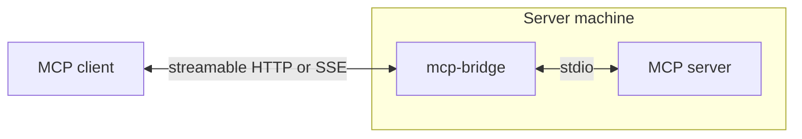
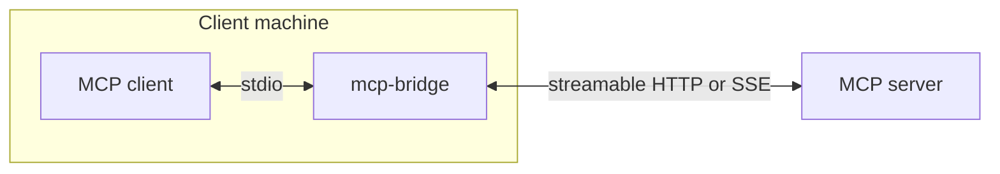

# mcp-bridge

[](https://github.com/hughhan1/mcp-bridge/actions/workflows/ci.yml)
[](https://go.dev/doc/install)
[](https://github.com/hughhan1/mcp-bridge/releases/latest)
[](LICENSE)

A Go library and CLI that forwards MCP between stdio and HTTP using the
[official Go MCP SDK](https://github.com/modelcontextprotocol/go-sdk).

## Install

```sh
curl -LsSf https://raw.githubusercontent.com/hughhan1/mcp-bridge/main/install.sh | sh
```

## CLI

### stdio to HTTP

Launch the MCP server as a subprocess and serve streamable HTTP at `/mcp` and
legacy SSE at `/sse`.



```sh
mcp-bridge serve --listen 127.0.0.1:8080 -- /path/to/mcp-server --stdio
```

<details open>
<summary><code>mcp-bridge serve --help</code></summary>

```text
Expose a stdio MCP server over Streamable HTTP and legacy SSE

Usage:
  mcp-bridge serve [flags] -- SERVER [ARG...]

Flags:
      --allow-origin origin       Trusted browser origin (repeatable)
      --cwd string                Server working directory
      --env KEY=VALUE             Server environment override KEY=VALUE (repeatable)
  -h, --help                      help for serve
      --listen string             HTTP listening address (default "127.0.0.1:8080")
      --protocol-version string   Require one MCP protocol version (default: automatic negotiation)
```

</details>

### HTTP to stdio

Launch the bridge as a subprocess and expose a remote streamable HTTP or legacy
SSE MCP server over stdio.



```sh
mcp-bridge connect https://example.com/mcp
mcp-bridge connect --transport sse https://example.com/sse
mcp-bridge connect --header 'Authorization: Bearer example' https://example.com/mcp
```

<details open>
<summary><code>mcp-bridge connect --help</code></summary>

```text
Expose a remote Streamable HTTP or legacy SSE MCP server over stdio

Usage:
  mcp-bridge connect [flags] URL

Flags:
      --header header      Remote header as Name: value (repeatable)
  -h, --help               help for connect
      --transport string   Remote transport: streamable-http or sse (default "streamable-http")
```

</details>

## MCP client configuration

For clients using an `mcpServers` configuration:

<details open>
<summary><h4>Connect a stdio client to a streamable HTTP server</h4></summary>

```json
{
  "mcpServers": {
    "example-mcp": {
      "command": "mcp-bridge",
      "args": ["connect", "https://example.com/mcp"]
    }
  }
}
```

</details>

<details open>
<summary><h4>Connect to a legacy SSE server</h4></summary>

```json
{
  "mcpServers": {
    "example-mcp": {
      "command": "mcp-bridge",
      "args": ["connect", "--transport", "sse", "https://example.com/sse"]
    }
  }
}
```

</details>

<details open>
<summary><h4>Include authentication and an additional HTTP header</h4></summary>

```json
{
  "mcpServers": {
    "example-mcp": {
      "command": "mcp-bridge",
      "args": [
        "connect", "https://example.com/mcp",
        "--header", "Authorization: Bearer TOKEN",
        "--header", "X-Tenant: example"
      ]
    }
  }
}
```

</details>

## Go API

This repository provides these Go packages:

- [`github.com/hughhan1/mcp-bridge/http`](http) exposes a stdio MCP server as an HTTP handler.
- [`github.com/hughhan1/mcp-bridge/stdio`](stdio) exposes a remote HTTP MCP server through a local transport, usually stdio.
- [`github.com/hughhan1/mcp-bridge/proxy`](proxy) provides raw tool pagination, MCP header encoding, and connection relaying for embedding proxies.

They run inside your Go program without invoking the CLI.

### stdio to HTTP

```go
import (
    "context"
    "errors"
    "net/http"
    "os/exec"

    mcpbridge "github.com/hughhan1/mcp-bridge/http"
)

func serve(ctx context.Context) error {
    bridge, err := mcpbridge.Start(ctx, func() *exec.Cmd {
        return exec.Command("/path/to/mcp-server", "--stdio")
    }, mcpbridge.Options{})
    if err != nil {
        return err
    }
    defer bridge.Close()

    // Serve locally, with cross-origin browser protection.
    server := &http.Server{
        Addr:    "127.0.0.1:8080",
        Handler: http.NewCrossOriginProtection().Handler(bridge),
    }
    defer server.Close()

    go func() { bridge.Wait(); server.Close() }()
    if err := server.ListenAndServe(); !errors.Is(err, http.ErrServerClosed) {
        return err
    }
    return bridge.Wait()
}
```

### HTTP to stdio

<details open>
<summary><h4>Streamable HTTP</h4></summary>

```go
import (
    "context"

    mcpbridge "github.com/hughhan1/mcp-bridge/stdio"
    "github.com/modelcontextprotocol/go-sdk/mcp"
    "golang.org/x/oauth2"
)

func connect(ctx context.Context, token string) error {
    client := oauth2.NewClient(ctx, oauth2.StaticTokenSource(&oauth2.Token{AccessToken: token}))
    return mcpbridge.Run(ctx,
        &mcp.StreamableClientTransport{Endpoint: "https://example.com/mcp", HTTPClient: client},
        &mcp.StdioTransport{},
    )
}
```

</details>

<details open>
<summary><h4>Legacy SSE</h4></summary>

```go
import (
    "context"

    mcpbridge "github.com/hughhan1/mcp-bridge/stdio"
    "github.com/modelcontextprotocol/go-sdk/mcp"
    "golang.org/x/oauth2"
)

func connectSSE(ctx context.Context, token string) error {
    client := oauth2.NewClient(ctx, oauth2.StaticTokenSource(&oauth2.Token{AccessToken: token}))
    return mcpbridge.Run(ctx,
        &mcp.SSEClientTransport{Endpoint: "https://example.com/sse", HTTPClient: client},
        &mcp.StdioTransport{},
    )
}
```

</details>
